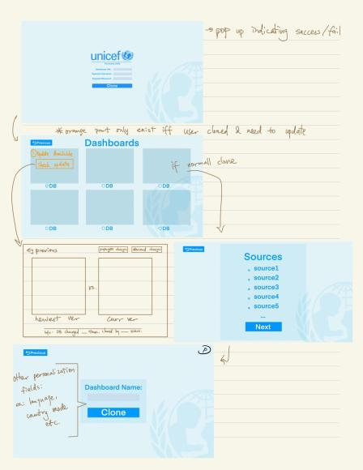
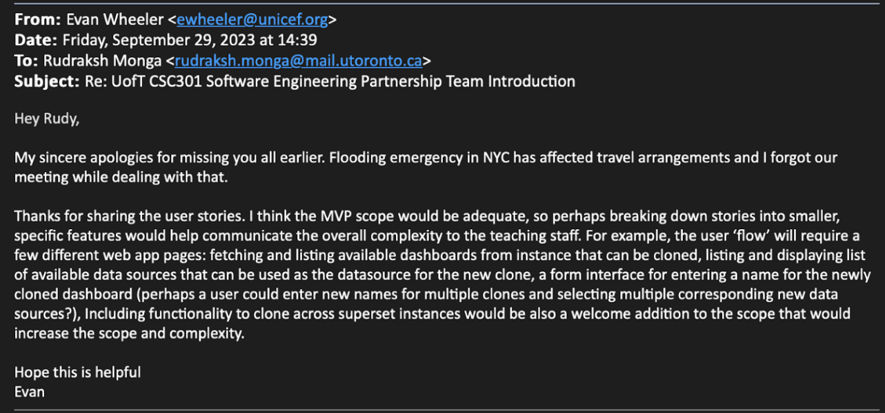

# Red Pandas, Team 12

## Product Details
 
### Q1: What is the product?

We will be building a web interface for the existing command line proof of concept that clones Apache Superset dashboards. Users will have the ability to modify and clone existing dashboards. The partner is UNICEF and this product will help the teams internally modify and clone their dashboards to make data-driven decisions. At a high level, the problem is not being able to easily clone as right now, we have to do redundent testing and there is no web interface for teams.  

### Q2: Who are your target users?

The tool we build will be used internally by UNICEF personnel who work in different countries. However, the tool will also be accessible to anyone who is working with Apache Superset dashboards. The project is aimed for people who have varying levels of expertise, and may not be well versed in Apache Superset. The goal is to create an intuitive interface for ease of use for our entire target users.

### Q3: Why would your users choose your product? What are they using today to solve their problem/need?

Currently, the proof of concept only works on a single instance of Apache Superset. This is problematic because when dashboards are cloned in different environments, for example staging and production, the dashboard must be recreated in production anyways. This means that the dashboard must be tested again in production, defeating the purpose of the staging environment. 

Secondly, the current proof of concept is a simple command line program. This is not very accessible for people who are not experienced in superset, so our web app will be more intuitive to use and allow for easier visualisation of data, regardless of a person’s given proficiency with superset. Additionally, it allows for smaller teams to do the cloning, we plan on expanding on this feature with a web application to allow use for larger teams. Evan has also mentioned that over a hundred different UNICEF offices utilise this tool. Due to the breadth at which it is used, there is a need to design it such that all offices can use the application to the same general level of proficiency.

Third, as we have discussed with Evan, he has put forward the need for such a program to be open source so that it can be copied and modified for a user’s given purposes.

### Q4: What are the user stories that make up the Minumum Viable Product (MVP)?

User Story 1: As a data analyst at UNICEF, I have many datasets. I would like to see the available dashboards that can be cloned with the other viable data sources I can use as the new datasource for the clone. 

Acceptance Criteria 1: Having multiple screens for available dashboards and viable data sources respectively. Being able to sort datasets in the view according to different features of the data and/or country and having clear indications of whether a dataset is viable with and reasons to why it is not viable.  

User Story 2: As a large team of data analysts, we would like to make use of the dashboard cloning capabilities to deploy ~130 copies for each country’s datasource.

Acceptance Criteria 2: Have a lightweight web interface that can support multiple users, user’s information is saved, a potential for group accounts that can allow for multiple users making edits as long as conflicts are limited.

User Story 3: As an open-source developer using Apache Superset, I would like to contribute to this project by increasing the scalability and improving the web application.

Acceptance Criteria 3: Web application has a test suite that runs each time new features are added/deployed, test suites that can be expanded upon as more features are added, have well-written and easily to follow documentation and instructions within the code, Read.me file, and the repository itself. Additionally,  regarding documentation, providing more visual examples of what the user should be met with when interacting with the application. 

User Story 4: As a developer responsible for deploying Apache Superset instances, I want to be able to clone dashboards across Superset instances so that I do not have to retest a dashboard in the production environment once it's passed all its tests in the staging environment. 

Acceptance Criteria 4: Given the user provides the correct details for accessing two Superset instances A and B, when the user clones a dashboard from one Superset instance A to Superset instance B, an exact replica of the dashboard should successfully appear within Superset instance B.

User Story 5: As a developer, I would want to customise the dataset features such as its name and add notes. I would also like to see new changes, especially since I work within a team.

Acceptance Criteria 5: Having screens prior and post cloning to edit names, adding notes, and the ability to link the dataset to another user. Having an option to view recent cloning, changes, or history to track activity. 

Proof of Acceptance from the partner:

### Q5: Have you decided on how you will build it? Share what you know now or tell us the options you are considering.

For our frontend, we have decided to use React.js with JavaScript. We will style our React app with TailwindCSS, which will allow us to speed up our development process since it allows us to use pre-built CSS classes for styling, allowing us to focus more on the actual functionality than the design. 

For our backend, we have decided to use Flask and Python. We originally wanted to use Node.js to gain experience with the MERN stack. However, the current proof of concept is built with Python scripts, so keeping our backend as Python will make it easier to integrate our code with the existing code. We will also be using FlaskAppBuilder since Apache Superset is also built using it. 

We will be using the Apache Superset APIs in the backend to do the initial cloning. 

Our liaison has communicated to us that it is acceptable for us to not deploy the product anywhere; rather, he is comfortable with this being hosted locally on a computer.

----
## Intellectual Property Confidentiality Agreement 
UNICEF values contributing to the open source community. Our partner believes that this project will not only be useful for UNICEF, but will also be desired by other companies. Therefore, we have received permission to upload the code on github and share it freely. This corresponds to option 1. 

----

## Teamwork Details

#### Q6: Have you met with your team?
We went and got lunch at Kensington but forgot to take a picture haha :D

1. This entire team is in the same section of CSC343
2. Two of our members go to the gym together
3. Two of our members lived in first-year residence together 

#### Q7: What are the roles & responsibilities on the team?

Rudraksh: Backend, dedicated partner liaison. I have done some back end Node.js and would like to learn more about using Flask.

Rohan: Front end + some backend. Aside from the prerequisite courses, I have not had exposure to developement so I would like to work on some aspects of each use case if possible, for an optimal learning experience. 

Jessica: Front end, some backend. I have HCI research experience and frond-end experience at OnePolicy so I believe I am more experienced in frontend compared to backend. However due to the same reason I wanted to get more backend experience through this project.

Manya: Backend. My experience in backend technologies such as Node.js, Express.js and PHP will allow me to contribute the most to the project. I tend to enjoy working on the backend more than front end so this will give me the opportunity to improve my skills in new technologies such as Flask.

Nick: Front end, some backend. Aside from my prerequisite courses I am also taking a course that will allow me to grow my skill set as a fullstack dev. However through my own personal experiences on my own projects, I have come to learn I am more adept when it comes to front end, which is why I prefer to focus on that more.

Andrew: Backend. With the courses I am taking this year, working on backend will complement my learning the best. I want to take this opportunity to gain a better working knowledge of Flask. Additionally, I enjoy working on the backend functionality of projects.

#### Q8: How will you work as a team?

As a team, we are planning to have weekly meetings online on Thursdays to discuss that week’s objectives, what progress has been made since the last meeting, any challenges, and coding sessions/reviews. We also have a discord server set up and a Google Docs document set up for each deliverable/project component so the work can be more active throughout the week.

We have had two meetings with our partner. 

As an overview of our first meeting we were introduced to the problem domain and the current proof-of-concept which is a command-line application that aims to solve the dashboard cloning problem for UNICEF employees. We were invited to the repository and asked to explore it and generate questions and concerns. Evan was lenient with what technologies we use for the web application, but the current POC is made with Python, Flask, and Flash App-Builder. We also discussed the IP concerns, which there are none, we are free to share the code since it is open source. We also discussed the future meeting schedules with Evan, which for now will be on the more “random” side due to his travel schedule. He mentioned that in mid-October he will be able to have a more concrete schedule and involve more of the engineers who worked on the product to help guide us as well. 

  
#### Q9: How will you organize your team?

For schedules we have a When2Meet set up and we will use the assignments as a rough timestamp to guide our development milestones. We will use the Github Project as a task board, and rank the TODO list to prioritise tasks. We determine the status of work completed through our code reviews, pull requests must have made signifcant changes prior the review. Overall we will discuss these details in the weekly meetings as well as update each other in the discord group chat.

#### Q10: What are the rules regarding how your team works?

Our team plans to meet online at least twice a week, once during the tutorial time and again on Thursday evenings. Our primary mode of communication will be our Discord channel. 

Our partner has a packed schedule until mid-October, so he will update a spreadsheet with his availability. We will use this to book meetings with him. After mid-October, he will have a more structured schedule, so we will be able to set up a consistent time to meet.

If a team member is not contributing, we will first attempt to understand why they are not responding as often. If it is due to stress, we will support them by helping them catch up on their work and taking on some of their tasks while they catch up. We will also encourage everyone to communicate when they are feeling stressed so that the other team members can be prepared.

 
**Collaboration: (Share your responses to Q8 & Q9 from A1)**

Responses from Assignment 1:

#### Rohan

Roles Preference: Backend Developer, Frontend Developer.

I have done well in 207 (5 members are the same from that team) and have the prerequisites done well. I am currently taking CSC343 (databases) so I can contribute on that end. I am also currently learning HTML/CSS and JavaScript on my own time prior to the project meetings and will ramp up on what I need to learn based on what the project outline is. I want to do well in this course and will be dedicating a lot of time to it.  

#### Rudraksh

Roles Preference: Backend Developer, DevOps Developer, Team Manager

I bring good transferrable backend programming skills in Node.js and Express.js that I can use to learn new backend frameworks as necessary. Over the summer, I also led the development of an MVP for a startup so I am aware of the responsiblities needed and things that need to be taken care of when working on a large scale project such as this. I am also proficient in frontend frameworks like React, so I can contribute to the frontend as necessary.

#### Manya

Roles Preference: Full stack, Backend developer, Product manager 

With my previous experience working with web development technologies such as Node.js and React.js through internships and side projects, as well as experience in Android mobile development, I believe I can contribute best to the team as a full stack or backend developer. I would also be open to trying out product manager roles such as communicating 

#### Jessica
   
Roles Preference: Product manager, Full-stack developer, Backend developer, Frontend developer, Database developer

With my experience in front end and graphic design I believe I can bring high quality front end designs to my team, I am also willing to organize meetings, documentations, and other details if needed. 

#### Andrew:

Roles Preference: Frontend developer, Backend developer, DevOps Developer

I consider myself to be a fast learner. Although I may not have all the skills required to masterfully contribute to every part of the project, I am confident in my ability to do my share of the work. Looking at the tech stack for our project, I am confident in my abilities to do any task in both JavaScript and Python. Additionally, I believe that I have the organizational and leadership skills to push my group forward, if it is ever needed.

#### Nick:

Roles Preference: Fullstack Developer, Frontend Developer, Backend Developer 

I have experience with Responsive Web Design and utilization of Figma for my personal projects. Similarly, I am currently learning the necessary skills to work effectively in a fullstack environment.

 * How are people held accountable for attending meetings, completing action items? Is there a moderator or process?
 * How will you address the issue if one person doesn't contribute or is not responsive?
   
We meet frequently in person and have a dedicated discord server for this project. Therefore issues can be resolved thorugh these means and if there is no response from a person then it makes sense to contact a TA (highly unlikely siutation). 
